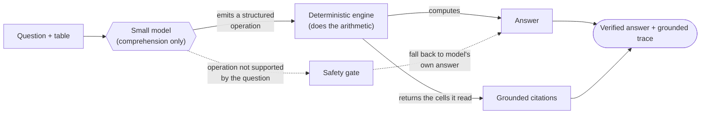

# Grounded Table Reasoning Traces

**Teach a small, locally-trainable model to read text tables, answer constrained questions, and emit
reasoning traces grounded in specific, verifiable cells - by routing the model's *comprehension*
through a deterministic engine that does the *arithmetic*.**

> **The finding:** small models comprehend table tasks well but can't reliably *execute* the
> arithmetic. Letting the model emit a structured *operation* and having a deterministic engine compute
> the answer lifts held-out accuracy **59.4% → 95.7%** on a locked test (254 tables, scored once) - a
> result that generalizes and is independently corroborated. The same move grounds the trace in the
> cells the engine actually read, lifting trace-groundedness **71.3% → 96.9%**.

📄 **Read the full write-up** (problem → approach → results → validation → honest limits → live demo):
**[amandineflachs.github.io/grounded-table-sft](https://amandineflachs.github.io/grounded-table-sft/)**
· **Results:** [`RESULTS.md`](RESULTS.md) · **ML methodology:**
[live](https://amandineflachs.github.io/grounded-table-sft/methodology.html)

> ℹ️ The write-up and methodology are served via **GitHub Pages** from the `/docs` folder. The source
> HTML lives in [`docs/`](docs/) - GitHub renders those files as source, so use the live links above (or
> open the files locally in a browser).

  

---

## How it works

The model never does the arithmetic. It *comprehends* - emits a structured operation (op type, column
names, thresholds, directions) - and a small, deterministic, independently-tested engine computes the
answer **and** returns the exact cells it read, which become the trace's citations. A safety gate falls
back to the model's own answer when the question doesn't actually support the emitted operation.



**Why this works:** error analysis showed the model's remaining mistakes were *arithmetic-execution*
errors (flipped comparisons, fumbled dominance checks), not misreadings. So we stopped trusting its
arithmetic and its hand-typed citations, and constructed both from what the engine actually did.

## The result

Locked held-out test, **254 tables, scored once** (no peeking, no retries):

| What we measured | Result | For comparison |
|---|---|---|
| **Right answers (engine)** | **95.7%** [92.4–97.6] | 59.4% when the model did the math itself |
| **Trace citations that point to the right cells** | **96.9%** | 71.3% from the model's own citations |
| Operation present / exact-match | 97.2% / 87.4% | |
| By question type (winner / threshold / trade-off) | 97.6% / 96.6% / 92.9% | |

Engine vs. the model's own arithmetic, head-to-head on the same items: **+93 / −1** (exact-McNemar
p ≈ 10⁻²⁶). Dev and test numbers match almost exactly - the result generalizes.

### Right-answer accuracy, stage by stage

Flat through every model-only stage (more size and training barely move it), then the engine closes it:

| Stage | Right answer | |
|---|---:|:---|
| Untrained Qwen3-1.7B | 18% | `███` |
| + fine-tuned (1.7B) | 20% | `███` |
| Untrained Qwen3-4B | 27% | `████` |
| + fine-tuned (4B) | 52% | `████████` |
| **+ deterministic engine** | **96%** | `███████████████` |

> **The catch (honestly bounded):** the engine only helps *inside its trained operation vocabulary*. On
> an unseen task type it confidently computes the wrong answer (0/12 on a held-out `extremum` slice,
> where the model's *own* answer was 100%). The safety gate catches exactly this and makes the system
> **never worse than the model alone**. See [`RESULTS.md`](RESULTS.md) for the full, caveated picture.

## The task

Three families of constrained, programmatically-verifiable questions over real financial tables from
**TAT-QA** (Zhu et al., ACL 2021; CC BY 4.0):

| Task | `question_type` | Example |
|------|-----------------|---------|
| Winner selection | `best_under_constraint` | "Which line item has the lowest 2019 value with 2018 ≥ 12.7?" |
| Constraint filtering | `threshold_filter` | "Which periods have rate ≥ 2.89 and term ≥ 3.65?" |
| Trade-off | `tradeoff_summary` | "Which line items are Pareto-optimal maximizing both 2019 and 2018?" |

Every example carries a machine-checked grounded trace; an independent rule-based validator recomputes
the answer and verifies each cited cell. **1,266 validated examples**, a **leakage-free, table-level
split** (dev 190 / locked test 254 / a separate 12-example out-of-distribution anchor), disjoint at id
*and* content-hash level.

## Quickstart (no GPU)

Replay held-out examples through the full production path (model *operation* → engine answer →
engine-read evidence cells → safety gate) from **saved outputs** - no GPU, no API, no network:

```bash
python -m venv .venv && . .venv/bin/activate      # Windows: .\.venv\Scripts\Activate.ps1
pip install -r requirements.txt
python scripts/demo.py                              # featured cards → results/demo/index.html
python scripts/demo.py --list                       # every replayable example
python scripts/demo.py --id <example_id>
```

Then open [`docs/index.html`](docs/index.html) and [`results/demo/index.html`](results/demo/index.html) in a browser.

## Reproduce the full pipeline

```bash
# build dataset / leakage-free split / SFT data (CPU)
python scripts/build_dataset.py            # synthetic sanity slice
python scripts/freeze_splits.py            # leakage-free table-level split
python scripts/build_sft.py                # SFT records (with operations)

# train + score (GPU: WSL .venv-train, RTX 3090 - see docs/training_env.md)
python scripts/train_sft.py   --model Qwen/Qwen3-4B --out models/qwen3-4b-sft-exec
python scripts/eval_executor.py --dataset data/processed/eval_test.v0_1_0.jsonl \
       --adapter models/qwen3-4b-sft-exec --out results/p3_4b_exec_TEST.json

# re-score on CPU (no GPU): grounding, safety gate, this write-up, the demo
python scripts/eval_grounded.py
python scripts/eval_gate.py
python scripts/build_writeup.py
python scripts/demo.py

# independent in-distribution anchor (CPU + blind LLM annotation)
python scripts/anchor_blind.py build --n 36 --seed 0
python scripts/anchor_blind.py score --answers results/anchor/answers.json
```

Headline numbers in `docs/index.html` and `RESULTS.md` are sourced directly from the result JSONs in
[`results/`](results/) - re-running `build_writeup.py` regenerates the page from them.

## v0 core (synthetic, zero-dependency)

The project began as a local-first slice with **no GPU, API, or network**: a seeded synthetic table
generator, the three task types, programmatic *grounded-by-construction* traces, the rule-based
validator, and an eval harness. It's still the fastest way to see the data contract and the validator
in action:

```bash
python scripts/build_dataset.py --n 40 --seed 0    # generate + validate every example
python scripts/evaluate.py data/processed/dataset.v001.jsonl
pytest tests/                                       # incl. deliberately-broken examples that MUST fail
```

## Layout

```
src/        schema, table utils, executor, question/trace templates, generator, validator
scripts/    build_dataset, freeze_splits, build_sft, train_sft, eval_executor, eval_grounded,
            eval_gate, eval_model, anchor_blind, demo, build_writeup, ... (full pipeline)
data/       raw/tatqa (CC BY 4.0), processed/ (validated JSONL eval inputs)
results/    locked-test metrics, gate + grounding re-scores, the independent anchor, demo page
docs/       index.html (narrative write-up), methodology.html (ML reference), training_env.md
tests/      validator unit tests
```

## License

Code: **MIT** - see [`LICENSE`](LICENSE). Tables under `data/raw/tatqa/` are from **TAT-QA**
(Zhu et al., ACL 2021), redistributed under **CC BY 4.0** with attribution; questions, traces, and the
engine are this project's own work.
